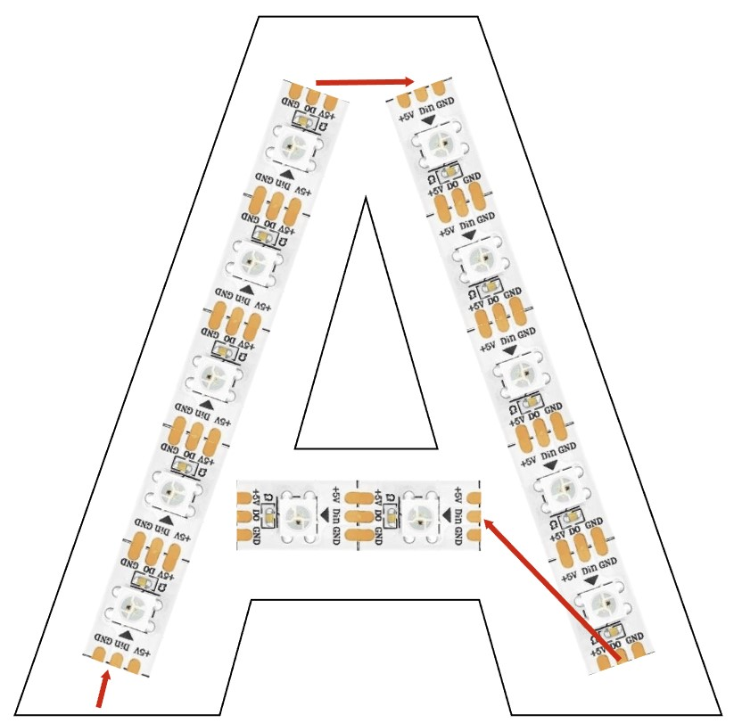
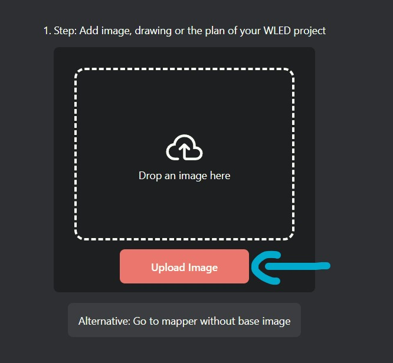
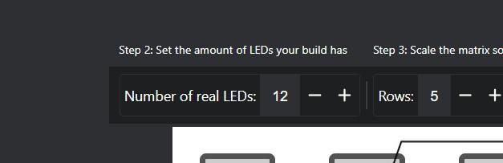
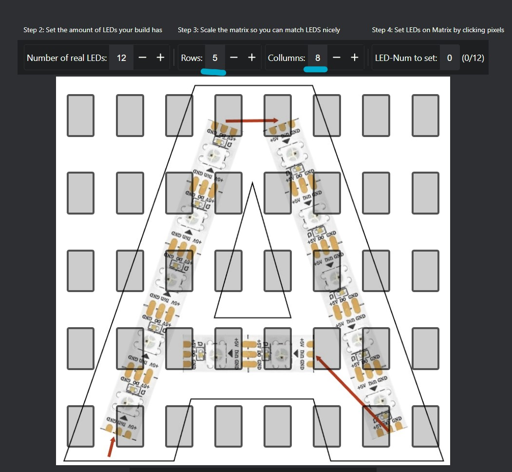
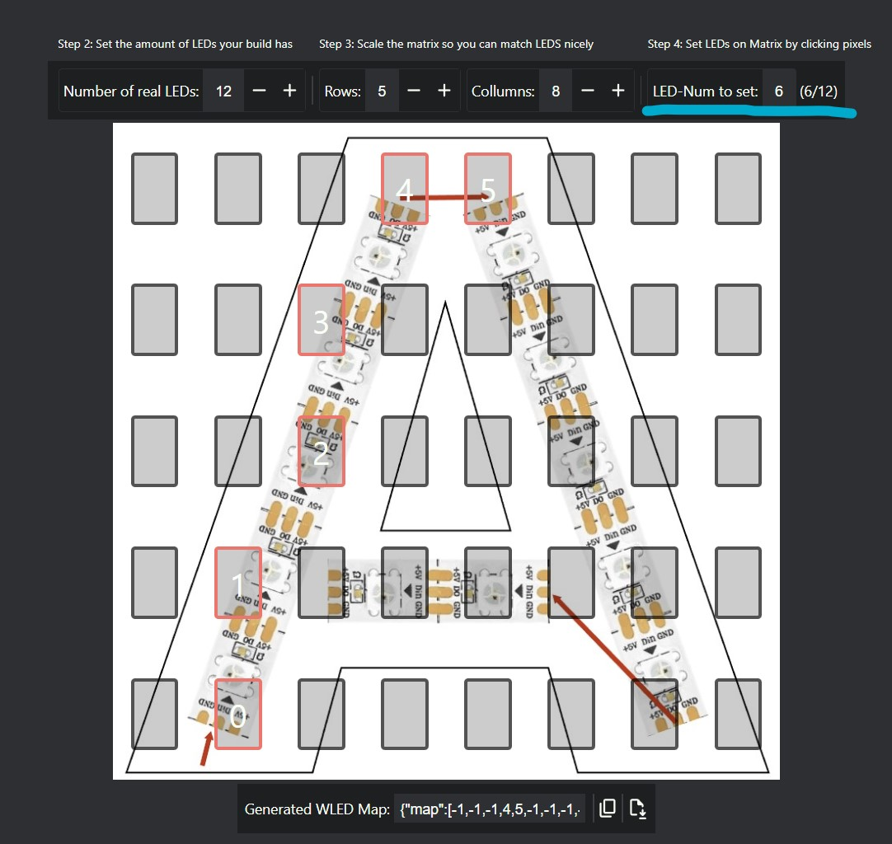
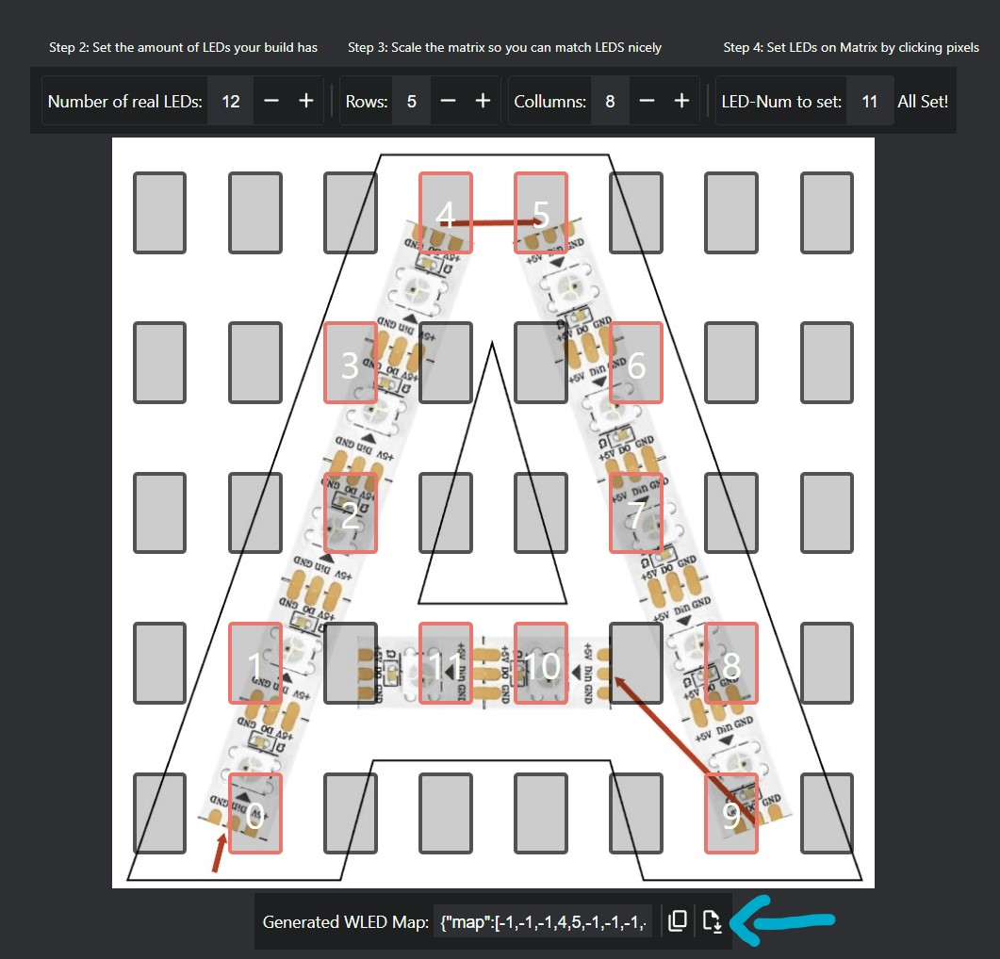

# Example Usage

> This DEMO uses a very simple A char to showcase how this works. Your project is very likely more complex

## Step 0 - Prepare your image
Take a photo of your LED project or use a Plan you already have digitaly. Make sure to crop it so the project fills the entire image, as this tool doesn't have cropping features. For this example, I'm using this image with a simple A char (you can use the same file to try it out: [Demo Image](./guide/SimpleDemoExample.jpg)).

## Step 1 - Insert image
Head over to https://mattstir.github.io/WLEDMapper/ and add your image using the ImagePicker or by dragging and dropping it into the field. (Note: Your image is not uploaded to any server. It remains stored locally in your browser's memory)

## Step 2 - How many LEDs does your build have?
Count the number of LEDs in your project. Our demo example has only 12 LEDs. Enter this number accurately in this field:

## Step 3 - Resize your matrix
Now, adjust the matrix size to fit your design. Keep in mind it won't be perfect. To prevent WLED performance issues, it's recommended to keep the matrix as small as possible. For our demo project, I've chosen a 5 by 8 matrix, which works well.

## Step 4 - Start placing your LEDs
Now for the fun part! Click the empty matrix spots in the same order you wired your physical project. Always choose the spot closest to your actual LED. The top right shows which index you're currently setting (WLED starts indexing at 0). If you make a mistake, you can adjust the next number to set. Next to it, you'll see how many LEDs you've set so far, and hovering over it will show which LEDs are missing. This can be really handy for larger projects.

## Step 5 - Export your map
Each time you make a change, the generated LED map updates automatically. When you're done, you can either copy the value or download the full file. Use it in WLED here: https://kno.wled.ge/advanced/mapping/

